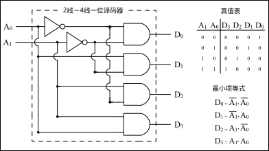
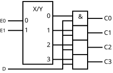
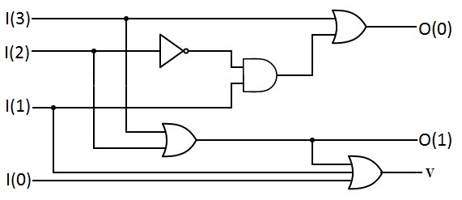
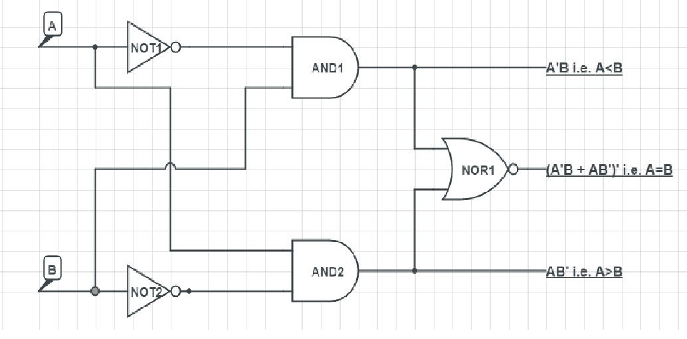
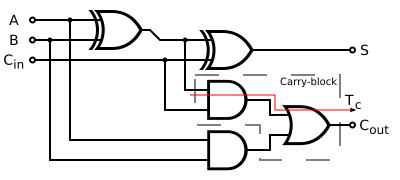
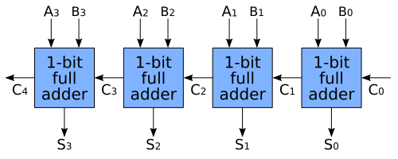
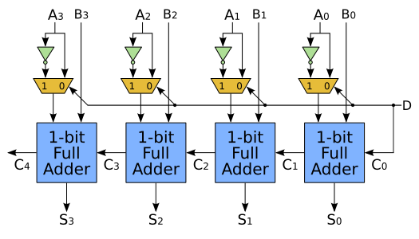
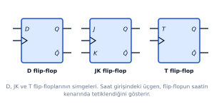

# circuit-diagram atlas — only through flip-flops

Since u are skipping counters and registers, this file covers the circuit-heavy material from **MUX/decoder through flip-flops**.

## common legend

- line crossing with a dot = connected wires
- line crossing without a dot = normally not connected
- small circle/bubble = NOT or active-low
- triangle on clock input = edge-triggered flip-flop
- `Q̄` / `Q'` = opposite of Q
- MSB = highest-value bit; LSB = lowest-value bit

# 1. 2-to-4 decoder



**Legend:**

- `A0,A1` are the two input/code bits.
- NOT gates produce the complemented inputs.
- Four AND gates produce `D0...D3`.
- Only one output is active for each input combination.
- Equations: `D0=A1'A0'`, `D1=A1'A0`, `D2=A1A0'`, `D3=A1A0`.
- To implement `F=Σm(1,2,3)`, OR decoder outputs `D1,D2,D3`.

[Web source and licence: Wikimedia Commons](https://commons.wikimedia.org/wiki/File:1_bit_Decoder_2-to-4_line.svg)

# 2. 1-to-4 DEMUX



**Legend:**

- `D` is the one data input.
- `E0,E1` are select inputs.
- `C0...C3` are outputs.
- Select inputs enable only one output path.
- Decoder vs DEMUX: a decoder activates an output from a binary code; a DEMUX routes actual data D to an output.

[Web source and licence: Wikimedia Commons](https://commons.wikimedia.org/wiki/File:1-to-4_demultiplexer_IEC_circuit.svg)

# 3. 4-to-2 priority encoder



**Legend:**

- Inputs are normally `D3,D2,D1,D0`, with `D3` given highest priority.
- Outputs `Y1Y0` give the binary number of the highest active input.
- If `D3=1`, lower inputs are ignored and output is `11`.
- Important equations: `Y1=D3+D2`, `Y0=D3+D2'D1`.
- A valid output `V=D3+D2+D1+D0` is usually added to distinguish D0 from no active input.

[Web source and licence: Wikimedia Commons](https://commons.wikimedia.org/wiki/File:A_4-2_Priority_Encoder_.jpg)

# 4. one-bit magnitude comparator



**Legend:**

- Inputs are A and B.
- Three separate outputs indicate `A>B`, `A=B`, and `A<B`.
- `A>B=AB'`
- `A=B=A XNOR B=A'B'+AB`
- `A<B=A'B`
- Only one comparison output should be 1 at a time.

[Web source and licence: Wikimedia Commons](https://commons.wikimedia.org/wiki/File:One-bit_binary_full_comparator,_equality,_inequality,_greater_than,_less_than_at_gate_level._Created_using_CircuitLab.jpg)

# 5. full adder gate circuit



**Legend:**

- Inputs: `A`, `B`, and carry-in `Cin`.
- Outputs: sum `S` and carry-out `Cout`.
- First XOR forms `A⊕B`; second XOR adds `Cin` to produce S.
- AND gates find the two ways a carry can occur; OR combines them.
- `S=A⊕B⊕Cin`
- `Cout=AB+Cin(A⊕B)`

[Web source and licence: Wikimedia Commons](https://commons.wikimedia.org/wiki/File:Full-adder_logic_diagram.svg)

# 6. full subtractor gate circuit


**Legend:**

- Inputs: A, B and borrow-in `Bin/Bor`.
- Outputs: difference D and borrow-out `Bout/Bor`.
- XOR path gives `D=A⊕B⊕Bin`.
- Lower gates detect when the current column must borrow from the next column.
- `Bout=A'B+Bin(A⊕B)'`

[Web source and licence: Wikimedia Commons](https://commons.wikimedia.org/wiki/File:FullSubtractor.svg)

# 7. four-bit ripple-carry adder



**Legend:**

- Four blue blocks are four one-bit full adders.
- `A0,B0` are LSB inputs; `A3,B3` are MSB inputs.
- Each carry-out becomes the next full adder's carry-in.
- `C0` is initial carry-in; `C4` is final carry-out.
- Outputs are `S3S2S1S0`.
- It is called ripple-carry because the carry must travel through the stages.

[Web source and licence: Wikimedia Commons](https://commons.wikimedia.org/wiki/File:4-bit_ripple_carry_adder.svg)

# 8. four-bit parallel adder-subtractor



**Legend:**

- The four blue blocks are full adders.
- The small yellow selectors/XOR stage controls each B bit.
- The common control is mode M.
- `M=0`: B passes unchanged and first carry is 0 → `A+B`.
- `M=1`: B is complemented and first carry is 1 → `A+B'+1=A−B`.
- Main formula: `Result=A+(B XOR M)+M`.
- Final carry is normally discarded during unsigned 2's-complement subtraction.

[Web source and licence: Wikimedia Commons](https://commons.wikimedia.org/wiki/File:4-bit_ripple_carry_adder-subtracter.svg)

# 9. BCD adder block diagram — reproduce this in the exam

A clean BCD adder is easier to remember as this labelled block flow:

```text
 A digit ─┐
          ├──> [first 4-bit binary adder] ──> S3 S2 S1 S0
 B digit ─┤                                  │
   Cin ───┘                                  ├──> [correction detector K]
                                             │
                  add 0000 when K=0 <────────┤
                  add 0110 when K=1          │
                                             v
                                  [second 4-bit adder]
                                             │
                                  corrected BCD digit + decimal carry
```

**Legend:**

- First adder performs ordinary binary addition.
- Detector uses `K=C4+S3S2+S3S1`.
- If K=1, second adder adds `0110`.
- K becomes the decimal carry to the next BCD digit.

# 10. D, JK and T flip-flop symbols



**Legend:**

- Left block is D FF: input D, and `Q(next)=D`.
- Middle block is JK FF: J sets, K resets, and `J=K=1` toggles.
- Right block is T FF: `T=0` holds and `T=1` toggles.
- Triangle at the middle-left input is the clock edge input.
- Q is normal output; `Q̄` is its complement.
- SR is similar to JK but uses S/R and has invalid input `S=R=1`.

[Web source and licence: Wikimedia Commons](https://commons.wikimedia.org/wiki/File:Flip_flop_D_JK_T_simgeleri_tr.svg)

# diagrams u should be able to redraw from memory

Prioritize these:

1. Full adder
2. Full subtractor
3. Four-bit adder-subtractor
4. BCD adder block diagram
5. 2-to-4 decoder
6. D, JK and T flip-flop symbols

Do not memorize exact artistic gate placement. Memorize the **inputs, equations, block connections and output labels**. A logically correct labelled circuit earns the marks even if it does not look identical to these images.
