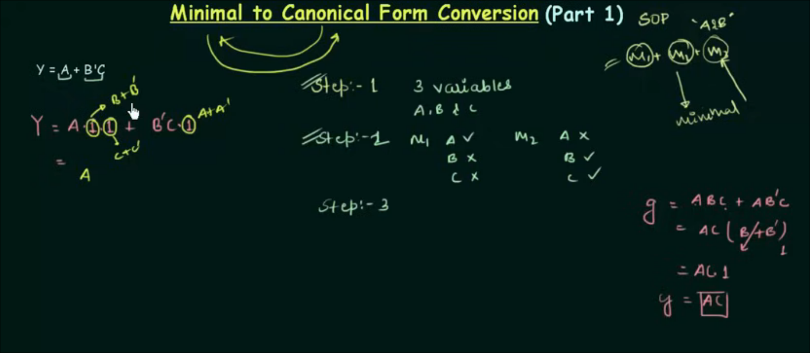
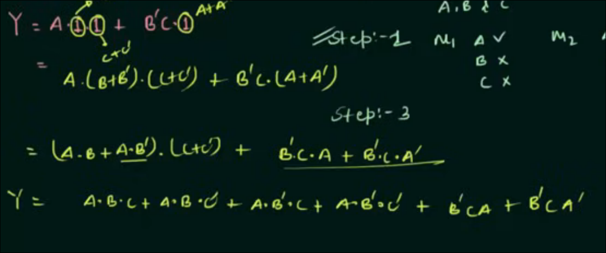
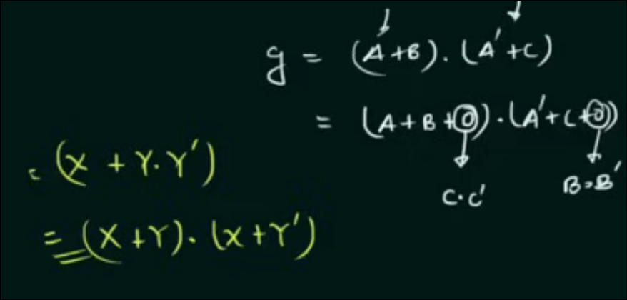
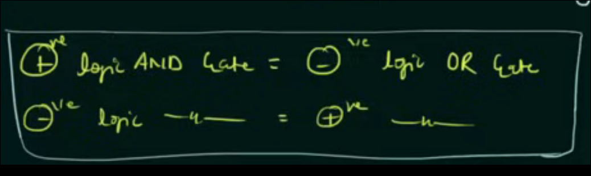

# minimal to canonical form (sop)

**you js gotta add the missing terms from the equation as (X+X') and multiply it thats it lwk**

uske baad aise distribute kardo bas

# minimal to canonical form (pos)

isme bhi relatively same hi hai bas (A.A') add hojata where missing term

bas baaki ek distributive law lagaya hai:

sumn like this.. thats all

## fianlly for all min/maxterms= 2^n where n is no. of terms and also all logical expressions = 2^2^n

dual form:

