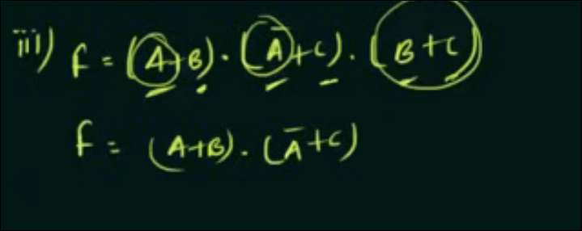
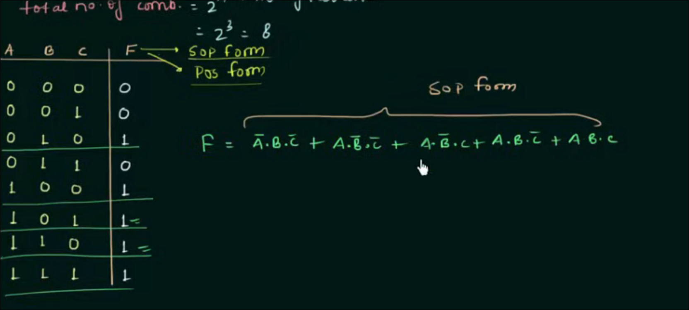
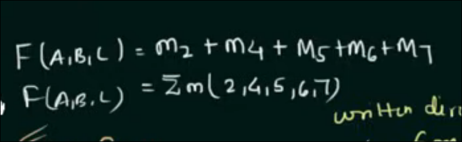
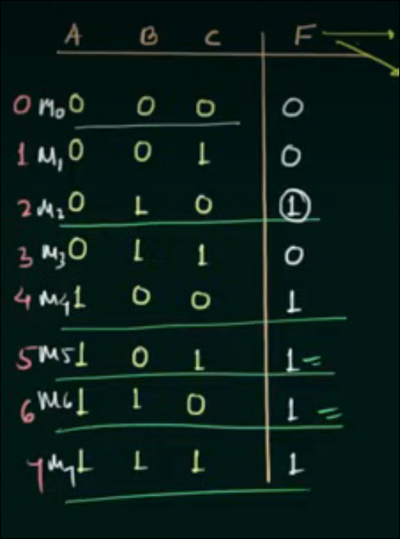
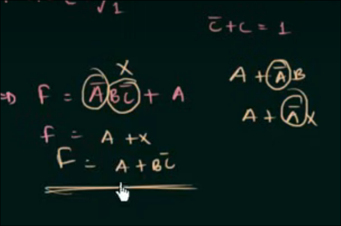
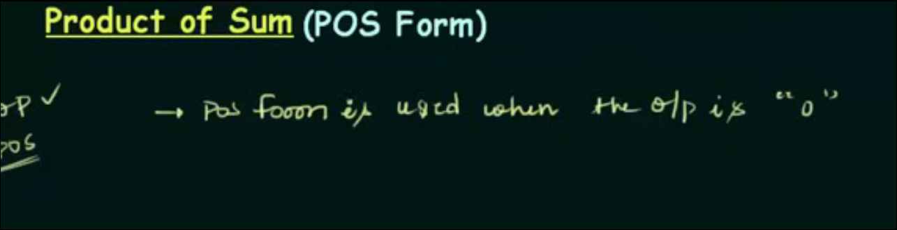
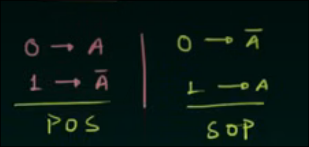
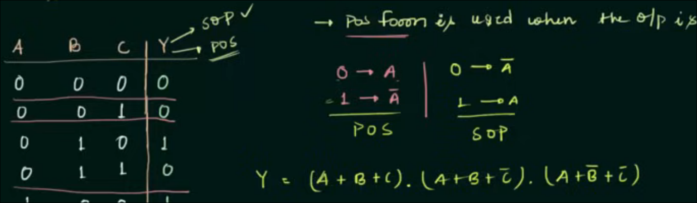
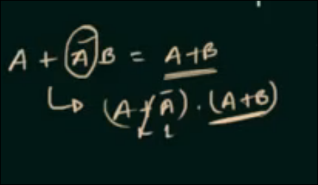

# redundancy theroem

omit wtv dont got da compliment, include all the complimented terms. (only three terms alr mentioned)

**for ex: AB+A'C+BC** 

**include AB and A'C bcs A got da compliment, ignore BC. thats it**

even in product of sum form, do da same. dooo dooo dooo

in these types of ques, just check what has both normal and compliment (in this case A)

# sum of product (SOP)

**ts easy gng, first u gotta look at when Y (or F or wtv) is 1, then add all those terms. how u ask? u js gotta take the complement of the term which is 0 and normal of the term which is 1**

basically how u see A=0, B=1, C=0, so first term is A'BC', like that for every term where Y is 1. thats it

heres he talking abt minterms, minterms r basically the product terms (ex: ABC, A'BC, etc.) minterm number is denoted by what the binary forms in decimal. **minterms are what makes the Y=1, dont confuse it for Y=0**

like so

## yo rmr this trick for distributive law

# product of sum (POS)

basic description (opposite of SOP)

wtf??

pretty basic

POS is also called maxterm

**mayn plsdont forget**

